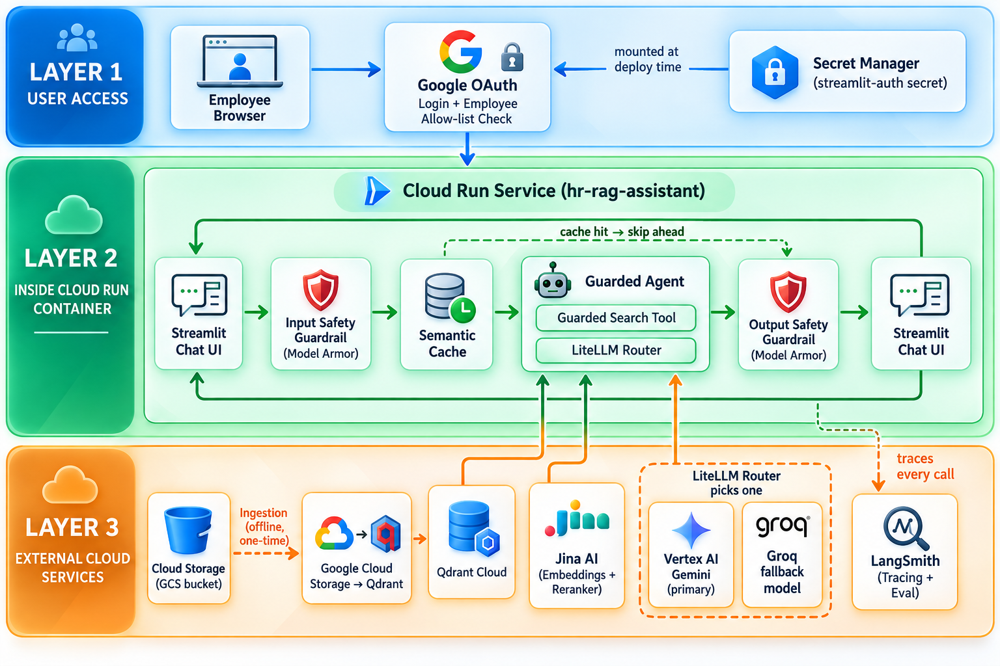
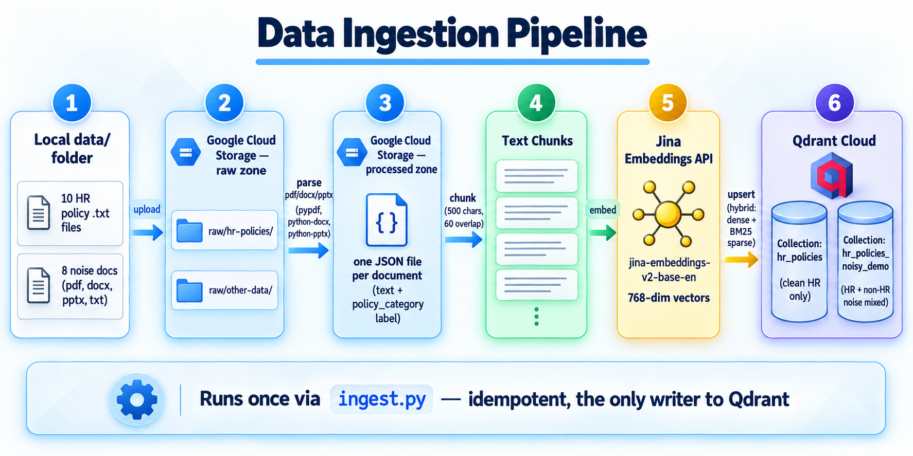
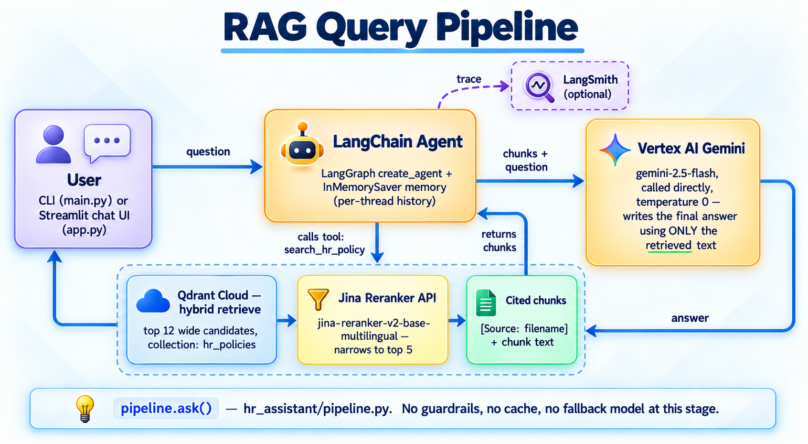
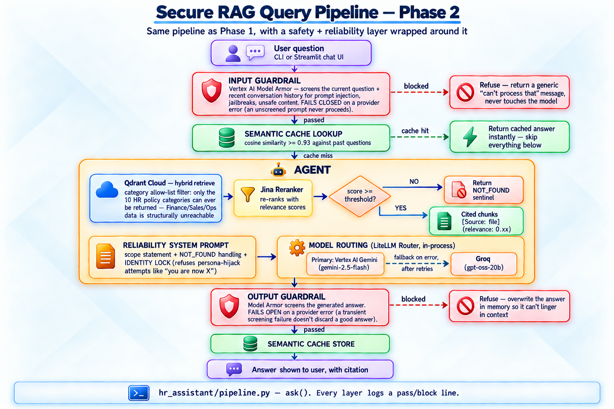
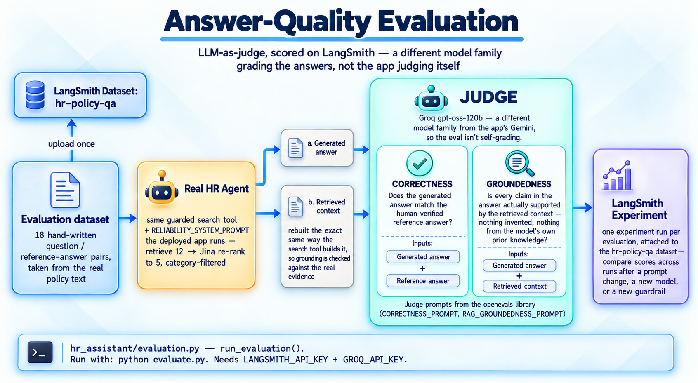
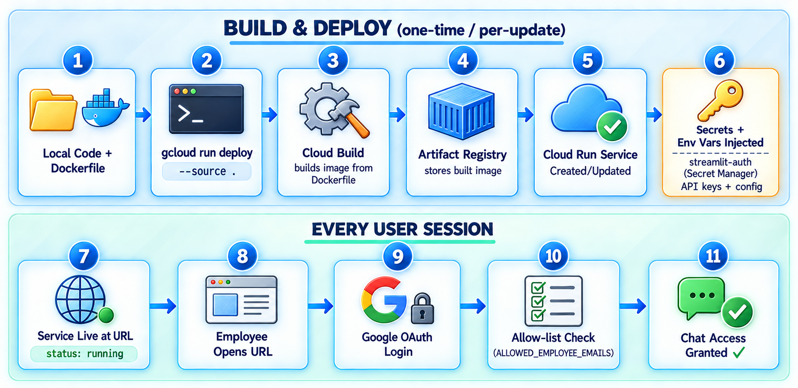

# MyHR-RAG

An HR-policy assistant: employees ask in chat, the system **retrieves** the
right policy chunks, **re-ranks** them, and **Gemini** writes a cited answer.

This repo is built in **three branches**. You are looking at **`basic-rag`**
(ingestion + query). Guardrails, cache, eval, and Cloud Run come later.

| Branch | What it adds |
|---|---|
| **`basic-rag`** *(this branch)* | Ingestion → hybrid search → re-rank → agent → cited answer |
| `ai-security` | Model Armor, semantic cache, scope filter, evaluation, Groq fallback |
| `deployment` | Docker, Cloud Run, Google OAuth, Secret Manager |

---

## Architecture (overall)

Three layers. Ingestion is **offline and one-time**. Every question at runtime
hits Qdrant + Jina + Vertex — not the raw files on disk.



### Layer 1 — User access *(deployment branch)*

Employee browser → **Google OAuth** + allow-list → Secret Manager holds the
Streamlit auth secret. Not wired on `basic-rag`.

### Layer 2 — App *(inside Cloud Run later; local Streamlit for now)*

```
Chat UI
  → input guardrail (Model Armor)     ← ai-security
  → semantic cache                    ← ai-security
  → Guarded Agent
        search tool + LiteLLM router
  → output guardrail                  ← ai-security
  → Chat UI
```

On **this branch** the path is shorter: **UI → agent → search tool → Gemini**.
No guardrails, no cache, no Groq fallback yet.

### Layer 3 — External cloud services

| Service | Role |
|---|---|
| **Cloud Storage** | Policy files (raw + processed JSON) |
| **Qdrant Cloud** | Vector store (hybrid dense + BM25) |
| **Jina AI** | Embeddings at ingest; reranker at query time |
| **Vertex AI Gemini** | Writes the answer from retrieved chunks only |
| **Groq** | Fallback LLM *(ai-security)* |
| **LangSmith** | Traces and evaluation *(optional / later)* |

Ingestion (dashed orange on the diagram) is the only path that **writes**
Qdrant. The chat app only **reads**.

---

## Data ingestion pipeline

Runs **once** via `ingest.py`. Idempotent: collections that already have
points are skipped unless you pass `--force`. This is the **only** writer to
Qdrant.



| Step | What happens | This repo |
|---|---|---|
| **1** | Local `data/` — 10 HR `.txt` policies + 8 noise docs (pdf / docx / pptx / txt) | `data/` and `data/noise/` |
| **2** | Upload to GCS **raw** zone | `raw/myhr-rag-data/` and `raw/other-data/` |
| **3** | Parse pdf/docx/pptx **once** → one JSON per document (`text` + `policy_category`) | `processed/…` via `processor.py` |
| **4** | Chunk — **500** characters, **60** overlap | `splitter.py` |
| **5** | Jina `jina-embeddings-v2-base-en` → **768-dim** vectors | `embeddings.py` |
| **6** | Upsert hybrid (dense + BM25 sparse) into **two** Qdrant collections | `vector_store.py` |

| Collection | Contents | Who uses it |
|---|---|---|
| `myhr-rag-data` | Clean HR policies | the app |
| `hr_policies_noisy_data` | HR + non-HR noise mixed | later retrieval / noise tests |

GCS bucket name is `myhr-rag` (same as the GCP project ID). Region for the
bucket is set at **create** time (`--location=us-central1`). `.env`
`LOCATION` is **Vertex AI / Gemini**, not the bucket.

Code map for this diagram:

```
data/  →  upload_corpus_to_gcs()     ingestion.py
       →  process_raw_to_json()      processor.py
       →  load + split + embed       document_loader / splitter / embeddings
       →  build_vector_store()       vector_store.py
```

```bash
# from the repo root (not from inside myhr_rag/)
python ingest.py              # skip collections that already have data
python ingest.py --force      # rebuild both
python ingest.py --hr-only
python ingest.py --noisy-only
python ingest.py --no-upload  # Qdrant only; GCS already uploaded
```

---

## RAG query pipeline *(basic-rag)*

No guardrails, no cache, no fallback model on this branch.



1. User asks in **CLI** (`main.py`) or **Streamlit** (`app.py`).
2. LangChain agent (`create_agent` + `InMemorySaver` memory) always calls
   **`search_hr_policy`** first.
3. Qdrant **hybrid retrieve** — wide shortlist, `RERANK_CANDIDATE_K = 12`.
4. Jina reranker (`jina-reranker-v2-base-multilingual`) — keep
   `TOP_K_RESULTS = 5`.
5. Cited chunks: `[Source: filename]` + text.
6. **Vertex Gemini** writes the answer from **those chunks only**
   (`temperature=0`). Optional **LangSmith** traces.

Gemini does **not** read the GCS bucket. It only sees what retrieval returned.

---

## What comes next (other branches)

These diagrams are the target design. They are **not** implemented on
`basic-rag`.

### Secure query pipeline — Phase 2 (`ai-security`)



Input Model Armor → semantic cache → agent (category filter + rerank +
LiteLLM Gemini / Groq fallback) → output Model Armor → cache store.

### Answer-quality evaluation



Hand-written Q&A pairs, same search path as the app, Groq judge for
**correctness** and **groundedness** on LangSmith.

### Build & deploy — Phase 3 (`deployment`)



`gcloud run deploy --source .` → Artifact Registry → Cloud Run → secrets.
Each user: URL → Google OAuth → email allow-list → chat.

---

## Setup

Steps will be filled in as we go. Current shape:

1. Copy `.env.example` → `.env` and fill keys (never commit `.env`).
2. `uv venv` + `uv pip install -r requirements.txt`.
3. `gcloud` on PATH, project `myhr-rag`, ADC + CLI login
   ([commands/gcp-project.md](commands/gcp-project.md)).
4. Qdrant Cloud cluster healthy; `QDRANT_URL` + `QDRANT_API_KEY` in `.env`.
5. Enable Vertex AI: `gcloud services enable aiplatform.googleapis.com --project=myhr-rag`
6. From **repo root:** `python ingest.py --force`, then `python main.py`.

`.env` needs: `PROJECT_ID`, `LOCATION`, `GCS_BUCKET_NAME`, `JINA_API_KEY`,
`QDRANT_URL`, `QDRANT_API_KEY`. For **`gemini-3.5-flash`** use
`LOCATION=global` (it is not in `us-central1`). LangSmith is optional.

Windows `gcloud` PATH, Git Bash vs PowerShell, and region knobs:
[commands/gcp-project.md](commands/gcp-project.md) ·
[commands/github.md](commands/github.md).

---

## Repository map

```
MyHR/
  ingest.py                 # python ingest.py  (repo root)
  main.py                   # CLI demo
  data/                     # HR .txt + data/noise/
  Images/                   # architecture diagrams (this README)
  myhr_rag/
    config.py               # 01  .env
    prompts.py              # 02  system prompt
    logging_config.py       # 03
    document_loader.py      # 04  GCS → LangChain Documents
    processor.py            # 05  pdf/docx/pptx → JSON
    splitter.py             # 06  chunks 500 / 60
    embeddings.py           # 07  Jina
    vector_store.py         # 08  Qdrant hybrid
    ingestion.py            # 09  orchestrates 04–08
    reranker.py             # 10
    tools.py                # 11  search_hr_policy
    llm.py                  # 12  Vertex Gemini
    agent.py                # 13
    pipeline.py             # 14  ask()
    tracing.py              # 15  LangSmith
    SEQUENCE.md             # numbered reading order
  commands/                 # gcloud, git, provisioning notes
```

Reading order for the Python package: [myhr_rag/SEQUENCE.md](myhr_rag/SEQUENCE.md).

---

## Stack

Python 3.12 · **uv** · LangChain / LangGraph · Vertex AI Gemini ·
Google Cloud Storage · Qdrant Cloud · Jina embeddings + reranker · Streamlit
(planned on this branch) · LangSmith (optional)
