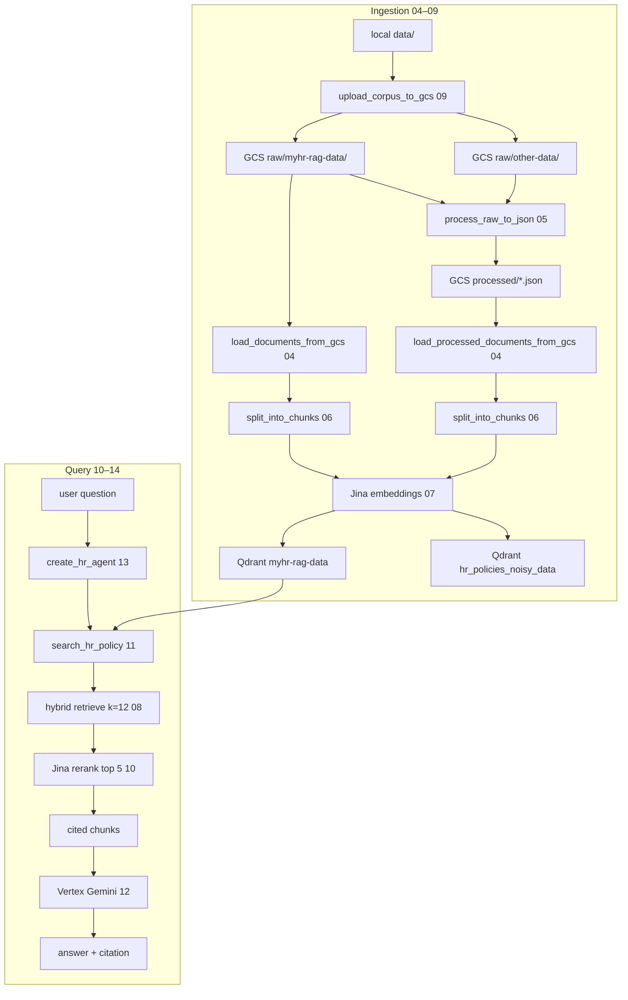

# MyHR RAG — Code Sequence

Package: `myhr_rag` (not `hr_assistant`). Every file is numbered in its
module docstring. Read them in that order.

**In the repo today:** **01** `config.py` · **02** `prompts.py` · **04**
`document_loader.py` · **05** `processor.py`. The rest of this file is the
planned sequence so later modules stay numbered the same way.

- **01–09** — foundations + ingestion (documents into Qdrant)
- **10–14** — query pipeline (question → retrieve → re-rank → agent → answer)
- **15** — tracing
- **16–19** — runnable entry points (`ingest.py`, `main.py`, `app.py` at the
  repo root; `studio_graph.py` in this package)

```
01 config                 ← exists
02 prompts                ← exists
03 logging_config         ← not written yet
04 document_loader        ← exists
05 processor              ← exists
06 splitter
07 embeddings
08 vector_store
09 ingestion
     │
     ▼
10 reranker
11 tools
12 llm
13 agent
14 pipeline
15 tracing
     │
     ▼
16 ingest.py          (repo root)
17 main.py            (repo root)
18 app.py             (repo root)
19 studio_graph.py    (this package)
```

This project’s GCP IDs live in `.env`: `PROJECT_ID=myhr-rag`,
`LOCATION=us-central1` (Vertex / Gemini), `GCS_BUCKET_NAME=myhr-rag`
(bucket **name**). Bucket `--location=us-central1` is set at create time,
not in `config.py`. See `commands/gcp-project.md`.

---

## Two pipelines

Ingestion and answering are separate. Ingestion **writes** Qdrant. The app
**connects** to what ingestion already built.

### A. Ingestion (offline, run once)

```
local data/
    → GCS raw/myhr-rag-data/  +  raw/other-data/     (09 upload)
    → GCS processed/...                              (05 parse pdf/docx/pptx once)
    → load documents (04)
    → chunk (06)
    → embed (07)
    → upsert Qdrant (08)
```

Two collections come out of this:

| Collection | Default name | Source | Who uses it |
|---|---|---|---|
| clean | `myhr-rag-data` | GCS raw `.txt` under `raw/myhr-rag-data/` | the app |
| mixed | `hr_policies_noisy_data` | GCS processed JSON (HR + noise) | later retrieval-vs-noise tests |

### B. Query (every question)

```
question
  → agent (13)  [system prompt 02 + LLM 12 + memory]
       → search_hr_policy tool (11)
            → Qdrant hybrid retrieve, wide (08, k = RERANK_CANDIDATE_K)
            → Jina reranker, narrow (10, top_n = TOP_K_RESULTS)
            → cited chunks
  → Gemini writes the answer from those chunks
  → answer + source citation
```

---

## 01 · `config.py` — settings from `.env`  ✅

Everything else imports this. Values only (keys, URLs, model ids, sizes).
Behavioural text lives in `prompts.py`.

**Loads:** `PROJECT_ID`, `LOCATION` (Vertex AI region, used later by
`llm.py`), `JINA_API_KEY`, `QDRANT_URL`, `QDRANT_API_KEY`,
`GCS_BUCKET_NAME`, optional LangSmith vars.

`LOCATION` is **not** the bucket region. The bucket name is
`GCS_BUCKET_NAME`.

**Defines (this repo):**

| Setting | Default / value | Role |
|---|---|---|
| `GCS_PREFIX` | `raw/myhr-rag-data/` | raw HR files |
| `NOISE_GCS_PREFIX` | `raw/other-data/` | raw non-HR noise |
| `PROCESSED_HR_PREFIX` | `processed/myhr-rag-data/` | parsed JSON (HR) |
| `PROCESSED_NOISE_PREFIX` | `processed/other-data/` | parsed JSON (noise) |
| `QDRANT_COLLECTION_NAME` | `myhr-rag-data` | clean collection the app uses |
| `QDRANT_NOISY_COLLECTION_NAME` | `hr_policies_noisy_data` | mixed collection |
| `LLM_MODEL_NAME` | `gemini-3.5-flash` | Vertex AI chat model |
| `EMBEDDING_MODEL_NAME` | `jina-embeddings-v2-base-en` | 768-dim English embeddings |
| `RERANKER_MODEL_NAME` | `jina-reranker-v2-base-multilingual` | cross-encoder re-rank |
| `CHUNK_SIZE` / `CHUNK_OVERLAP` | `500` / `60` | splitter (06) |
| `TOP_K_RESULTS` | `5` | chunks kept after re-rank |
| `RERANK_CANDIDATE_K` | `12` | wide shortlist before re-rank |
| `LANGSMITH_PROJECT` | `myhr-rag` | tracing project name |

**Key function:** `check_api_keys()` — fail fast if `PROJECT_ID`,
`JINA_API_KEY`, `QDRANT_URL`, `QDRANT_API_KEY`, or `GCS_BUCKET_NAME` is
missing. (`LOCATION` is not in that list.)

---

## 02 · `prompts.py` — system instruction  ✅

Behavioural config (prose the model reads), kept apart from `config.py`.

`SYSTEM_PROMPT` tells the agent to:

1. Always call `search_hr_policy` before answering.
2. Say “I don’t know” if the answer is not in the search results — never guess.
3. Cite the policy document the answer came from.
4. Decline non-HR questions (leave, WFH, probation, notice, reimbursement,
   code of conduct, holidays, maternity/paternity, travel, exit).
5. Match answer length to the question (broad → complete; narrow → concise;
   follow-ups stay on the same topic).

Used later by `agent.py` (13).

---

## 03 · `logging_config.py` — console logging  (planned)

One place to turn on readable stdout logging. Library modules log at INFO;
they do not `print()`.

**Key function:** `configure_logging()` — attach a handler once per process.
Called by every entry point (16–19). Idempotent, so Streamlit reruns are
safe.

`processor.py` already uses `logging.getLogger(__name__)`; this module will
wire the handler.

---

## 04 · `document_loader.py` — read documents from GCS  ✅

Two readers, no parsing of binaries. Imports `from myhr_rag import config`.
Uses `storage.Client(project=config.PROJECT_ID)`.

| Function | Reads | Returns |
|---|---|---|
| `load_documents_from_gcs()` | raw zone `.txt` under `GCS_PREFIX` (`raw/myhr-rag-data/`) | LangChain `Document`s |
| `load_processed_documents_from_gcs()` | processed zone `.json` written by (05), both HR + noise prefixes | LangChain `Document`s |

Each `Document` has `page_content` (the text) and metadata: `source`,
`policy_category`, `gcs_path`.

**Shared helper:** `extract_policy_category(text)` — first 5 lines,
`Policy Category:` (HR) or `Category:` (noise). Also used by processor (05).

Clean ingestion (09) calls the raw `.txt` loader. Noisy ingestion calls the
processed JSON loader.

---

## 05 · `processor.py` — parse binaries to JSON, once  ✅

```
raw/<prefix>/file.pdf|docx|pptx  --parse-->  processed/<prefix>/file.json
```

Prefix map (`_RAW_TO_PROCESSED`):

| Raw | Processed |
|---|---|
| `raw/myhr-rag-data/` | `processed/myhr-rag-data/` |
| `raw/other-data/` | `processed/other-data/` |

Called by noisy ingestion (09) so PDFs/DOCX/PPTX are parsed a **single**
time, not on every vector-store rebuild. `.txt` is decoded as-is.

**Parsers:** `_parse_pdf` (pypdf), `_parse_docx` (python-docx), `_parse_pptx`
(python-pptx).

**Key functions:**

- `parse_blob(blob)` — dispatch on extension.
- `process_raw_to_json()` — walk raw HR + noise prefixes, write one JSON
  record per file: `source`, `policy_category`, `text`, `raw_gcs_path`.

document_loader (04) then reads those JSON records back.

---

## 06 · `splitter.py` — chunk documents  (planned)

`split_into_chunks(documents)` — `RecursiveCharacterTextSplitter` with
`CHUNK_SIZE=500` and `CHUNK_OVERLAP=60`. Metadata (`source`,
`policy_category`) copies onto every chunk.

---

## 07 · `embeddings.py` — text → vectors  (planned)

`get_embeddings_model()` returns Jina embeddings
(`jina-embeddings-v2-base-en`) using `JINA_API_KEY`. Deliberately not GCP
ADC — a second vendor beside Vertex.

Used by vector_store (08) for both **build** (embed + upsert) and **load**
(query-time embedding of the question). Changing the embedding model
changes vector dimension → `python ingest.py --force`.

---

## 08 · `vector_store.py` — Qdrant store + search  (planned)

Dense (Jina vectors) + sparse (BM25 / `Qdrant/bm25`) hybrid search.

**Two entry points:**

| Function | When | What |
|---|---|---|
| `build_vector_store(chunks, …)` | ingestion (09) only | embed + upsert |
| `load_vector_store(name)` | pipeline / query | connect to an **existing** collection, no embed/upsert |

**Also:**

- `collection_exists(name)` — collection is there **and** has at least one point.
- `_stable_chunk_id(chunk)` — UUID5 from `(source, text)` so re-ingestion **upserts** instead of duplicating.
- `get_retriever(store, k, filter_categories)` — LangChain retriever; optional payload filter on `metadata.policy_category`.

On build, creates a keyword payload index on `metadata.policy_category` so
filtered search works.

---

## 09 · `ingestion.py` — orchestrate 04–08  (planned)

The **only** writer to Qdrant. The app never ingests on a normal run — it
connects to what this built.

```
local data/ files
    → GCS raw/myhr-rag-data/  +  raw/other-data/     upload_corpus_to_gcs()
    → GCS processed/...                              process_raw_to_json()  (05)
    → chunk (06) → embed (07) → Qdrant (08)
```

**Key functions:**

| Function | Collection | Document source |
|---|---|---|
| `upload_corpus_to_gcs()` | — | `data/*.txt` → raw HR; `data/noise/*` → raw noise |
| `ingest_hr_policies()` | clean `myhr-rag-data` | `load_documents_from_gcs()` (raw `.txt`) |
| `ingest_noisy_corpus()` | mixed `hr_policies_noisy_data` | `load_processed_documents_from_gcs()` (JSON; parses raw first if empty) |
| `run_ingestion(...)` | both | checks API keys, then upload + HR + noisy |

Idempotent: if the collection already has points, skip. `force=True` rebuilds.

Runnable wrapper is `ingest.py` (16).

---

## 10 · `reranker.py` — re-score the shortlist  (planned)

Retrieval (08) is fast but rough. The reranker reads the **question and each
candidate together** (Jina cross-encoder REST: `https://api.jina.ai/v1/rerank`)
and returns the top `TOP_K_RESULTS` documents, best first.

`rerank(query, candidates, top_n)` — no extra SDK, plain `requests`.

---

## 11 · `tools.py` — retrieve + re-rank as one agent tool  (planned)

`create_search_tool(vector_store)` returns a LangChain `@tool` named
`search_hr_policy`.

Per call:

1. `get_retriever(..., k=RERANK_CANDIDATE_K)` — wide hybrid retrieve (12 chunks).
2. `rerank(..., top_n=TOP_K_RESULTS)` — narrow to 5.
3. Format as `[Source: filename]\nchunk text`.

The agent (13) decides **when** to call it. The system prompt (02) says:
always, before answering.

---

## 12 · `llm.py` — connect to Gemini  (planned)

`get_llm()` — one LangChain chat model: Vertex AI Gemini
(`LLM_MODEL_NAME`, default `gemini-3.5-flash`), `temperature=0`. Auth is
Application Default Credentials (`gcloud auth application-default login`).
Uses `.env` `LOCATION=us-central1`.

No fallback routing at this stage.

---

## 13 · `agent.py` — LLM + tool + prompt + memory  (planned)

`create_hr_agent(llm, tools, checkpointer)` wraps LangChain `create_agent`:

- **model** — Gemini (12)
- **tools** — `search_hr_policy` (11)
- **system_prompt** — `SYSTEM_PROMPT` (02)
- **checkpointer** — short-term memory (same `thread_id` remembers; new id = clean slate)

Pass `checkpointer=None` when LangGraph Studio supplies persistence itself
(`studio_graph.py` / 19).

---

## 14 · `pipeline.py` — wire it together + `ask()`  (planned)

```
question → agent (search tool 11 + short-term memory) → answer
```

**Key functions:**

- `_bootstrap_collection(name, ingest_fn)` — if Qdrant is empty, upload + ingest once; otherwise a no-op.
- `build_hr_assistant(checkpointer=None)` — `check_api_keys()`, bootstrap clean collection, load vector store, create agent. Default checkpointer is `InMemorySaver`. `checkpointer=False` builds with none (Studio).
- `ask(agent, question, thread_id)` — one turn. Reads `.text` off the last message.

---

## 15 · `tracing.py` — LangSmith  (planned)

Does **not** turn tracing on. LangChain reads `LANGSMITH_TRACING` /
`ENDPOINT` / `API_KEY` / `PROJECT` from the environment (loaded by config).

`check_langsmith_tracing()` logs once per run whether traces will be sent.
`app.py` calls it at startup. Also runnable as
`python -m myhr_rag.tracing`.

---

## 16 · `ingest.py` (repo root) — CLI for ingestion  (planned)

Calls `run_ingestion()` (09).

```bash
uv run python ingest.py                 # ingest whatever is missing
uv run python ingest.py --force         # rebuild both collections
uv run python ingest.py --hr-only
uv run python ingest.py --noisy-only
uv run python ingest.py --no-upload     # skip pushing local data/ to GCS
```

Run once after filling in `.env`. `main.py` / `app.py` assume this has
already been run (pipeline will bootstrap the clean collection if it is
completely missing).

---

## 17 · `main.py` (repo root) — CLI demo  (planned)

`build_hr_assistant()` then `ask()` on a fixed list of HR questions.

```bash
uv run python ingest.py    # once
uv run python main.py
```

---

## 18 · `app.py` (repo root) — Streamlit chat UI  (planned)

```bash
uv run streamlit run app.py
```

Caches the agent with `@st.cache_resource`. One `thread_id` per browser
session. Sidebar “New conversation” mints a new thread. Calls
`check_langsmith_tracing()` at startup.

---

## 19 · `studio_graph.py` — LangGraph Studio  (planned)

```bash
uv run langgraph dev
```

`langgraph.json` points at module-level `graph`. Builds the agent with
`checkpointer=False` so Studio can supply its own persistence.

---

## Call graph (who imports whom)

```
config (01)          ← imported by almost every module   ✅
prompts (02)         ← agent (13)                        ✅
logging_config (03)  ← ingest / main / app / studio / tracing   planned

document_loader (04) ← processor (05, category helper), ingestion (09)   ✅
processor (05)       ← ingestion (09)                    ✅
splitter (06)        ← ingestion (09)
embeddings (07)      ← vector_store (08)
vector_store (08)    ← ingestion (09), tools (11), pipeline (14)

ingestion (09)       ← ingest.py (16), pipeline bootstrap (14)
reranker (10)        ← tools (11)
tools (11)           ← pipeline (14)
llm (12)             ← pipeline (14)
agent (13)           ← pipeline (14)
pipeline (14)        ← main.py (17), app.py (18), studio_graph (19)
tracing (15)         ← app.py (18)
```

---

## End-to-end data flow


